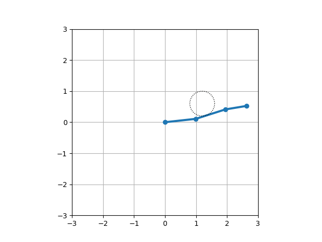
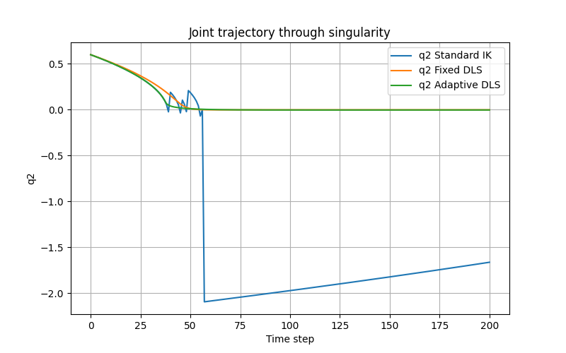

# Singularity-Aware Inverse Kinematics for a 3-DOF Planar Robot

> **Portfolio Technical Report**
- *Author:* Bùi Đức Quân
- *Date:* 6/1/2026

> **Robotics Motion Planning & Control Portfolio Project**  
> Focus: Jacobian singularity and numerical stability

---

## 📌 Project Overview

This project investigates a **core problem in robotic motion control**:
**instability of inverse kinematics near kinematic singularities**.

Using a **3-DOF planar robotic arm**, the project demonstrates:
- Why standard Jacobian-based inverse kinematics fails
- How joint velocities explode near singular configurations
- How **Damped Least Squares (DLS)** stabilizes the system

The goal is not just to make the robot move, but to **understand and fix a real
numerical problem that appears in real robots**.

This repository is designed as a **technical portfolio project** for robotics,
motion planning, and control engineering roles.

---

## 🤖 Robot System

- **Robot type:** 3-DOF planar serial manipulator  
- **Joint type:** Revolute (R–R–R)  
- **Workspace:** 2D plane  
- **Purpose:** Simple system to clearly expose singularity behavior  

---

## ⚠️ The Singularity Problem

In Jacobian-based inverse kinematics, the robot computes joint velocities from
desired end-effector motion.

However, near a **singular configuration**:
- The robot loses motion capability in certain Cartesian directions
- The Jacobian becomes ill-conditioned
- Very small end-effector motion requires extremely large joint velocities

This leads to:
- Numerical instability
- Unrealistic joint motion
- Unsafe behavior in real robots

This project intentionally drives the robot **toward singularity** to clearly
expose this issue.

---

## ❌ Baseline: Standard Inverse Kinematics

The first experiment uses **standard inverse Jacobian IK** as a baseline.

Observed behavior:
- Joint velocity magnitude increases rapidly
- Motion becomes unstable near singularity
- The controller fails even though the desired motion is small

This confirms the known limitation of classical Jacobian inverse methods.

---

## ✅ Solution: Damped Least Squares (DLS)

To address the instability, the project implements
**Damped Least Squares (DLS) inverse kinematics**.

Key ideas:
- Introduce damping to prevent numerical blow-up
- Trade exact tracking accuracy for stability
- Ensure joint velocities remain bounded

With DLS:
- The robot remains stable near singularity
- Joint motion stays smooth
- End-effector tracking remains acceptable

This approach is widely used in:
- Industrial manipulators
- Redundant robots
- Motion planning and control systems

---

## 🧪 Simulation Setup

- Discrete-time simulation
- Small time step for numerical stability
- Robot is intentionally moved close to singular configurations
- Comparison between:
  - Standard IK
  - DLS-based IK

---

## 📊 Results

### Key observations:
- **Standard IK:** joint velocity explodes near singularity
- **DLS IK:** joint velocity remains bounded and smooth

### Visualization:
- Robot motion animation
- End-effector trajectory tracking
- Clear qualitative difference between the two methods

A complete animation is provided in `demo.gif`.

---

## 🧠 Skills Demonstrated

- Understanding of kinematic singularity
- Jacobian-based inverse kinematics
- Numerical stability in control algorithms
- Damped Least Squares method
- Robotics-oriented Python simulation
- Engineering problem analysis (not just coding)

---

## 🚀 Future Improvements

- Manipulability analysis
- Joint limit avoidance
- Extension to higher-DOF manipulators
- Integration with ROS2 or physics simulators

---

