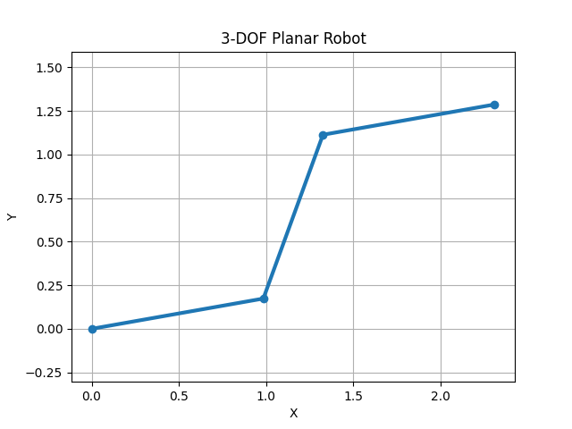

# Singularity-Aware Inverse Kinematics for a 3-DOF Planar Robot

> **Portfolio Technical Report**
- *Author:* Bùi Đức Quân
- *Date:* 6/1/2026
- *Repository:* [LINK GITHUB]

---

## 1. Introduction

Inverse Kinematics (IK) is a fundamental problem in robotics, where the objective is to compute joint motions that achieve a desired end-effector motion. Near kinematic singularities, classical Jacobian-based inverse methods become numerically unstable, leading to large joint velocities and poor tracking performance.

This project implements and evaluates a **Singularity-Aware Inverse Kinematics** approach using the **Damped Least Squares (DLS)** method for a **3-DOF planar robotic manipulator**. The focus is on:

* Stable end-effector trajectory tracking
* Robust behavior near singular configurations
* Clear simulation and visualization suitable for engineering portfolios

---

## 2. System Description

### 2.1 Robot Model

The system under study is a **3-DOF planar serial manipulator** consisting of three revolute joints. All motion is constrained to the 2D plane.

* Joint variables:
  [
  \mathbf{q} = [q_1, q_2, q_3]^T
  ]
* Link lengths:
  [
  (l_1, l_2, l_3) = (1.0,; 1.0,; 1.0) ; \text{[m]}
  ]

> **Figure 1:** 3-DOF planar robot model with joint angles and link lengths.

---

## 3. Forward Kinematics

The forward kinematics maps joint space variables (\mathbf{q}) to the end-effector position (\mathbf{x} = [x, y]^T).

The end-effector position is computed as:
[
\begin{aligned}
x &= l1cos(q1 + l_2 \cos(q_1+q_2) + l_3 \cos(q_1+q_2+q_3) \
y &= l_1 \sin q_1 + l_2 \sin(q_1+q_2) + l_3 \sin(q_1+q_2+q_3)
\end{aligned}
]

This formulation is used both for visualization and for computing the tracking error during inverse kinematics.

---

## 4. Jacobian Matrix

The Jacobian relates joint velocities to end-effector linear velocities:
[
\dot{\mathbf{x}} = J(\mathbf{q}) , \dot{\mathbf{q}}
]

For the 3-DOF planar robot, the Jacobian is a (2 \times 3) matrix:

[
J(\mathbf{q}) =
\begin{bmatrix}

 l1*s1 - l2*s{12} - l_3 s_{123} & - l_2 s_{12} - l_3 s_{123} & - l_3 s_{123} \
  l_1 c_1 + l_2 c_{12} + l_3 c_{123} &   l_2 c_{12} + l_3 c_{123} &   l_3 c_{123}
  \end{bmatrix}
  ]

where:
[
\begin{aligned}
s_1 &= \sin(q_1), \quad c_1 = \cos(q_1) \
s_{12} &= \sin(q_1+q_2), \quad c_{12} = \cos(q_1+q_2) \
s_{123} &= \sin(q_1+q_2+q_3), \quad c_{123} = \cos(q_1+q_2+q_3)
\end{aligned}
]

---

## 5. Inverse Kinematics Method

### 5.1 Problem Formulation

Given a desired end-effector position (\mathbf{x}_d), the tracking error is defined as:
[
\mathbf{e} = \mathbf{x}_d - \mathbf{x}
]

The goal is to compute joint velocities (\dot{\mathbf{q}}) that reduce this error.

---

### 5.2 Adaptive Damped Least Squares (Adaptive DLS)

To handle singular and near-singular configurations more effectively, an **Adaptive Damped Least Squares (Adaptive DLS)** inverse kinematics scheme is employed.

The joint velocity command is computed as:

\[
\dot{\mathbf{q}} = J^T \left( J J^T + \lambda(\sigma_{\min})^2 I \right)^{-1} \mathbf{e}
\]

where:
- \(\mathbf{e} = \mathbf{x}_d - \mathbf{x}\) is the end-effector tracking error,
- \(\sigma_{\min}\) is the smallest singular value of the Jacobian matrix \(J\),
- \(\lambda(\sigma_{\min})\) is a configuration-dependent damping factor.

### Adaptive damping condition

The damping coefficient is defined as a function of the smallest singular value of the Jacobian:

\[
\lambda(\sigma_{\min}) =
\begin{cases}
0, & \sigma_{\min} > \sigma_0 \\
\lambda_0 \left(1 - \dfrac{\sigma_{\min}}{\sigma_0}\right), & \sigma_{\min} \le \sigma_0
\end{cases}
\]

This adaptive strategy ensures that:
- Far from singularities (large \(\sigma_{\min}\)), the controller behaves similarly to the Moore–Penrose pseudoinverse, enabling accurate end-effector tracking.
- Near singular configurations, the damping term increases smoothly, preventing excessive joint velocities and numerical instability.

📌 *Parameter note:*  
> **Adaptive damping parameters:**  
> \(\sigma_0 = 0.05\),  
> \(\lambda_0 = 0.2\).  
> These parameters were selected empirically to balance numerical stability and end-effector tracking accuracy.

📌 *Parameter note:*

> **Damping value (\lambda):** The damping factor λ introduces a trade-off between tracking accuracy and numerical stability. A moderate value (λ = 0.1) was chosen to ensure smooth joint motions while maintaining acceptable end-effector tracking performance.

---

## 6. Simulation Setup

### 6.1 Discrete-Time Simulation

Joint angles are updated using a forward Euler integration scheme:
[
\mathbf{q}_{k+1} = \mathbf{q}_k + \dot{\mathbf{q}}_k , \Delta t
]

Simulation parameters:

* Time step: (\Delta t = 0.05) s
* Total steps: [GHI SỐ STEP – BỔ SUNG]
* Initial configuration: (\mathbf{q}_0 = [0, 0, 0]^T)

---

### 6.2 Target Trajectory

The desired end-effector trajectory is a circular path defined as:
[
\begin{aligned}
x_d(t) &= x_c + r \cos t \
y_d(t) &= y_c + r \sin t
\end{aligned}
]

Trajectory parameters:

* Center: ((x_c, y_c) = [GHI] )
* Radius: (r = [GHI])

---

## 7. Results and Visualization

### 7.1 Robot Motion

The robot successfully tracks the moving target using the DLS-based IK controller. Motion remains smooth even when approaching near-singular configurations.

📌 *Figure placeholder:*

> **Figure 2:** Robot configuration snapshots during trajectory tracking.
> *(HÌNH – BỔ SUNG)*

---

### 7.2 End-Effector Trajectory

The end-effector path closely follows the desired circular trajectory, with minor steady-state errors due to damping.

📌 *Figure placeholder:*

> **Figure 3:** End-effector trajectory (red dashed line) and moving target (green point).
> *(HÌNH / GIF – BỔ SUNG)*

---

### 7.3 Animation Output

A complete animation of the simulation is exported as a GIF file:

📁 **File:** `demo/demo.gif`

This animation is used directly in the GitHub README to visually demonstrate system performance.

---

## 8. Discussion

The Damped Least Squares method provides robust behavior near singularities by trading off exact tracking accuracy for numerical stability. While damping introduces small tracking errors, it significantly improves overall system reliability.

Observed limitations:

* Fixed damping factor may not be optimal for all configurations
* No joint limits considered
* Dynamic effects are neglected

---

## 9. Conclusion

This project demonstrates a complete pipeline for singularity-aware inverse kinematics, from mathematical modeling to simulation and visualization. The results show that DLS is an effective and simple method for stabilizing Jacobian-based IK in planar robots.

---

## 10. Future Work

Potential extensions include:

* Adaptive damping based on singular values
* Manipulability ellipsoid visualization
* Joint limit avoidance
* Extension to 3D manipulators
* Integration with ROS2 or physics engines

---

## References

[1] B. Siciliano et al., *Robotics: Modelling, Planning and Control*, Springer.
[2] Y. Nakamura, *Advanced Robotics: Redundancy and Optimization*, Addison-Wesley.

[def]: figures/Figure_1.png